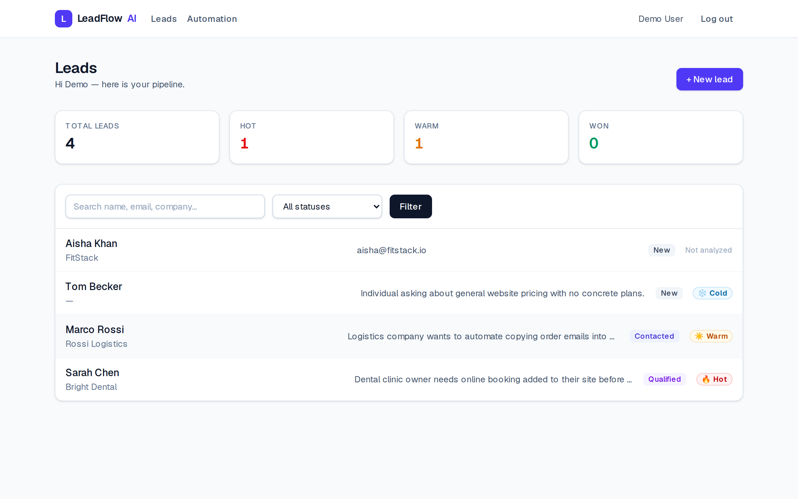
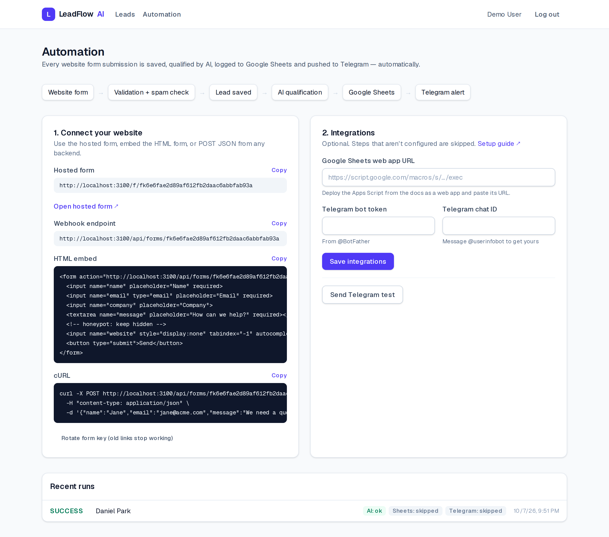
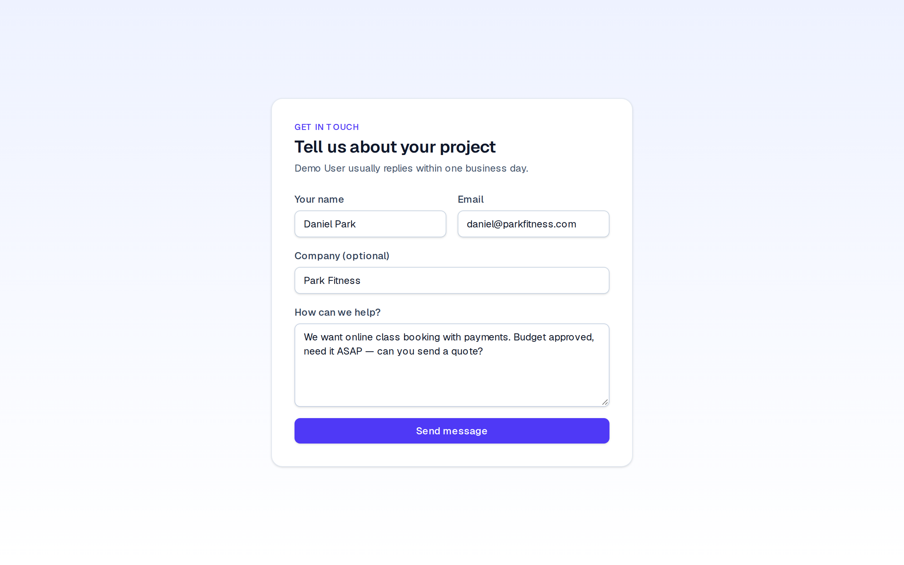
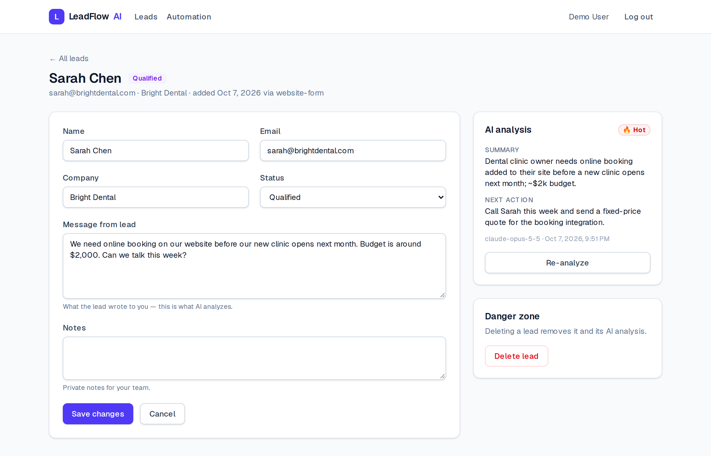
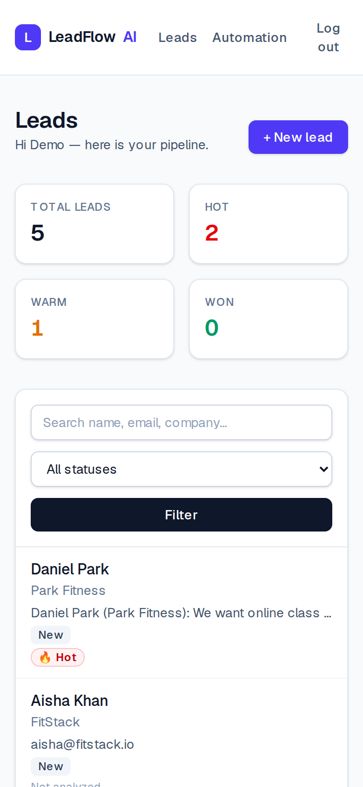

# LeadFlow AI

**AI lead qualification for small teams.** Capture inbound leads from your website, let Claude summarize each message, score it **Hot / Warm / Cold**, and suggest the next action — so you always know who to call first.

Full-stack Next.js app with a REST API, PostgreSQL, session auth, AI integration, and a Playwright end-to-end suite running in GitHub Actions.



| Automation: form → AI → Sheets → Telegram | Client website form |
| --- | --- |
|  |  |

| Lead detail + AI analysis | Mobile |
| --- | --- |
|  |  |

## Features

- **Auth** — register / login / logout with bcrypt-hashed passwords and a signed, httpOnly JWT session cookie. Protected routes via Next.js Proxy plus server-side checks on every page, action and API route.
- **Lead management** — create, edit, delete, search and filter leads by status. Every query is scoped to the owner, so users can never see each other's data.
- **AI analysis** — Claude (`claude-opus-5-5`) returns a validated JSON object `{ summary, temperature, nextAction }` via structured outputs (Zod schema). The lead text is treated as untrusted input. Refusals and API errors are handled with user-friendly messages.
- **Website form automation** — website form → validation + spam check → lead saved → AI qualification → Google Sheets row → Telegram alert, running in the background with a per-step run log (`SUCCESS` / `PARTIAL` / `FAILED`). Hosted form, HTML embed and JSON webhook. See [docs/AUTOMATION.md](docs/AUTOMATION.md).
- **Offline mode** — without `ANTHROPIC_API_KEY` (or with `AI_MOCK=1`) a deterministic keyword analyzer is used, so the demo and CI work with no API cost.
- **REST API** — `GET/POST /api/leads`, `GET/PATCH/DELETE /api/leads/:id`, `POST /api/leads/:id/analyze`, `GET /api/health`, public `POST /api/forms/:formKey`. Validation errors return `422` with per-field details.
- **Polish** — loading skeletons, error boundary, empty states, accessible forms (labels, `aria-invalid`, `role="alert"`), responsive layout.

## Tech stack

Next.js 16 (App Router, Server Actions) · TypeScript · Tailwind CSS 4 · PostgreSQL 16 · Prisma 7 · Zod · jose · Anthropic SDK · Playwright · Docker · GitHub Actions

## Architecture

```
Website form ──► POST /api/forms/:key ──► lead saved ──► after(): AI → Sheets → Telegram → run log

Browser ──► Next.js Proxy (optimistic session check)
              │
              ├── Pages (Server Components) ──► Server Actions ─┐
              └── REST API routes ──────────────────────────────┤
                                                                ▼
                                     lib/leads.ts (owner-scoped data access)
                                         │                     │
                                     Prisma ──► PostgreSQL   lib/ai.ts ──► Claude API
                                                                (or offline analyzer)
```

## Quick start

```bash
cp .env.example .env            # then set SESSION_SECRET (openssl rand -base64 32)
npm install
npm run db:up                   # Postgres in Docker on :5435
npm run db:migrate
npm run db:seed                 # demo@leadflow.dev / demo12345
npm run dev                     # http://localhost:3100
```

Add `ANTHROPIC_API_KEY` to `.env` to use real Claude analysis.

**Run everything in Docker:** `SESSION_SECRET=... docker compose --profile app up --build` (run `npm run db:deploy` against the DB once).

## Testing

```bash
npm run test:e2e        # builds the app, starts it, runs the suite
npm run test:e2e:ui     # Playwright UI mode
npx playwright show-report
```

**32 end-to-end tests** across desktop Chrome and a Pixel 7 viewport:

| Area | What is covered |
| --- | --- |
| Authentication | register, login/logout, wrong password, unknown email (same generic error), input validation, duplicate email |
| Access control | redirect when signed out, forged session cookie, signed-in redirect away from /login, cross-user lead isolation (UI) |
| Lead CRUD | create, validation with preserved input, edit + persistence after reload, delete, cancel delete, search + status filter |
| AI analysis | hot / cold classification, summary + next action rendered, dashboard stats update, empty-message error |
| REST API | health check, 401 without session, full CRUD + analyze, 422/400 on bad payloads, cross-user 404s, PATCH partial update |
| Automation | hosted form → AI-qualified lead + run log, public form validation, JSON / HTML-form / honeypot / unknown key, rate limiting (429), integration settings validation (SSRF guard), Telegram test |
| Responsive | core flow on mobile, no horizontal overflow |

CI (`.github/workflows/ci.yml`) runs lint → typecheck → migrations → Playwright against a Postgres service container on every push and PR, and uploads the HTML report as an artifact.

> The suite caught a real bug during development: `PATCH /api/leads/:id` with only `{ "status" }` wiped the lead's message, notes and company, because Zod defaults still applied in the partial schema. See [docs/QA_REPORT.md](docs/QA_REPORT.md).

## Project structure

```
src/
  app/            pages, layouts, server actions, API routes
  components/     UI, forms, AI panel
  lib/            db, session, auth (DAL), validation, AI, lead service
  proxy.ts        route protection
prisma/           schema, migrations, seed
e2e/              Playwright tests + fixtures
```
